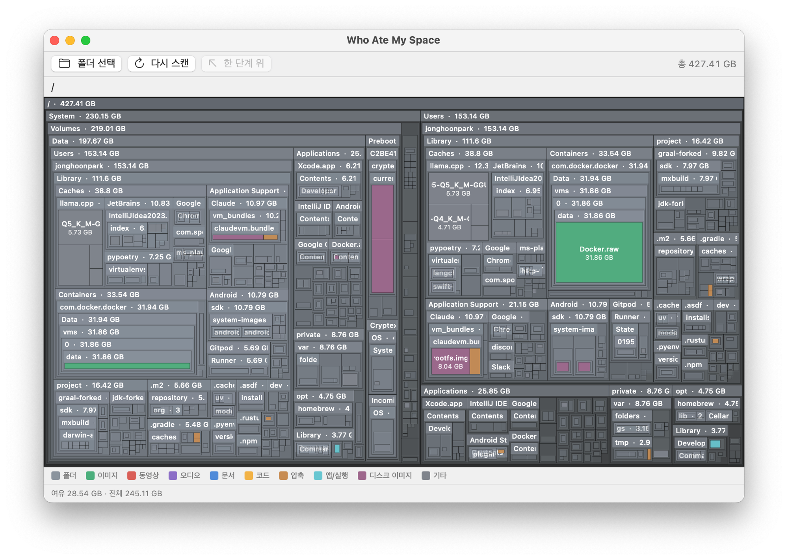

# Who Ate My Space

> 🇰🇷 한국어 문서는 [README.ko.md](README.ko.md)를 참고하세요.

A disk-usage visualizer for macOS — a native SwiftUI app inspired by Windows'
[SpaceSniffer](https://www.uderzo.it/main_products/space_sniffer/).

It scans a folder or volume and renders every file and folder as a **treemap
whose area is proportional to size**. See what's eating your disk at a glance,
then clean it up straight to the Trash.



> A scan of the root (`/`). Folder headers show name and size; files are filled
> with type-based colors (e.g. green = image `Docker.raw`, magenta = disk image
> `rootfs.img`).

## Features (v1)

- Parallel recursive scan of folders/volumes (size on disk, similar to `du`)
- Squarified treemap rendering (SwiftUI Canvas)
- Color by file type, with a legend
- Two-way navigation: click a folder to zoom in, breadcrumb / up-one-level to zoom out
- Hover to show path and size, with highlight
- Right-click menu: Reveal in Finder / Open / Copy path / Move to Trash
- Volume free / total capacity display
- One-click shortcut to **System Settings → Storage**
- English / Korean localization (follows the system language)

## Not real-time — rescan to refresh

The treemap is a **snapshot taken at scan time**, not a live view. If files
change on disk after a scan (you delete something in Finder, a download
finishes, a build writes new artifacts), the treemap will **not** update on its
own.

To see the current state, click **Rescan** (the ↻ button in the toolbar) — it
re-runs the scan on the same root. Moving an item to the Trash from inside the
app _does_ update the treemap immediately, since the app knows about that
change; everything else needs a rescan.

## Requirements

- macOS 13 (Ventura) or later
- Xcode 15+
- [XcodeGen](https://github.com/yonyz/XcodeGen) (`brew install xcodegen`)

## Build & run

```bash
# 1) Generate the Xcode project
xcodegen generate

# 2-a) Open in Xcode and run
open WhoAteMySpace.xcodeproj
#     → select the "My Mac" target, then Run (⌘R)

# 2-b) Or build from the command line
xcodebuild -scheme WhoAteMySpace -configuration Debug build

# Tests
xcodebuild -scheme WhoAteMySpace -destination 'platform=macOS' test
```

## Permissions — Full Disk Access is safe to grant

This app runs **non-sandboxed**. A folder you pick via `Choose folder` is
scanned without extra permission, but to scan **system-protected areas** (other
users' folders, some system paths, etc.) macOS requires Full Disk Access.

> System Settings → Privacy & Security → **Full Disk Access** → add `WhoAteMySpace.app`

**It is safe to grant all storage / disk permissions.** This app does only one
thing with your files: it reads their _sizes_ to draw the treemap. There is
**no networking code in the project** — nothing is uploaded, sent, or copied
anywhere off your machine. It never opens a socket, never makes an HTTP request,
and has no analytics or telemetry. The only actions that touch your files are
the explicit ones you trigger: Reveal in Finder, Open, Copy path, and Move to
Trash. The source is open — you can verify every file operation in
[`Sources/WhoAteMySpace/Utilities/FileActions.swift`](Sources/WhoAteMySpace/Utilities/FileActions.swift)
and [`Scanner/DiskScanner.swift`](Sources/WhoAteMySpace/Scanner/DiskScanner.swift).

Without permission, inaccessible items are skipped and the scan continues.

## Distribution (outside the App Store — dmg)

Distribution outside the App Store requires **Developer ID signing +
notarization** (Apple Developer Program membership, $99/year).

```bash
# 1) Release build → .app
xcodebuild -scheme WhoAteMySpace -configuration Release \
  -derivedDataPath build clean build

APP="build/Build/Products/Release/WhoAteMySpace.app"

# 2) Sign with a Developer ID Application certificate (with Hardened Runtime)
codesign --force --deep --options runtime \
  --sign "Developer ID Application: YOUR NAME (TEAMID)" "$APP"

# 3) Package as a dmg
hdiutil create -volname "Who Ate My Space" -srcfolder "$APP" \
  -ov -format UDZO WhoAteMySpace.dmg

# 4) Notarize (with an app-specific password or keychain profile)
xcrun notarytool submit WhoAteMySpace.dmg \
  --apple-id "you@example.com" --team-id "TEAMID" \
  --password "APP_SPECIFIC_PASSWORD" --wait

# 5) Staple the notarization ticket
xcrun stapler staple WhoAteMySpace.dmg
```

Verify:

```bash
spctl -a -vvv -t install WhoAteMySpace.dmg   # Gatekeeper check
codesign -dvvv "$APP"                          # signature / runtime check
```

> Without an Apple Developer account, you can only run a development-signed
> build locally. Recipients of such a dmg must right-click → "Open" on first
> launch to get past Gatekeeper.

## Localization (i18n)

The UI ships in **English and Korean** and follows the system language. Strings
live in `.lproj` bundles:

```
Resources/
├── en.lproj/   Localizable.strings · InfoPlist.strings
└── ko.lproj/   Localizable.strings · InfoPlist.strings
```

To add a language, create a new `<lang>.lproj` directory with translated
`Localizable.strings` / `InfoPlist.strings`, add its path to `project.yml` as a
`resources` build phase, and list the code in `CFBundleLocalizations` in
`Resources/Info.plist`.

## Structure

```
Sources/WhoAteMySpace/
├── App/         App entry + top-level layout
├── Models/      FileNode (tree node)
├── Scanner/     DiskScanner (parallel recursive scan)
├── Treemap/     TreemapLayout (squarified) + TreemapRect
├── Views/       TreemapView / Breadcrumb / Legend / ScanProgress
├── ViewModels/  ScanViewModel (state / navigation / file ops)
└── Utilities/   FileColor / FileActions / ByteFormat
```

## Limitations / roadmap (v2 candidates)

- Filter & search (size / extension / date), exclude patterns
- Live monitoring, multiple volumes, snapshot comparison
- Quick Look preview
- Single-volume scan (mount-boundary handling), hard-link dedup correction

## License

Released under the [MIT License](LICENSE). © 2026 Jonghoon Park.
